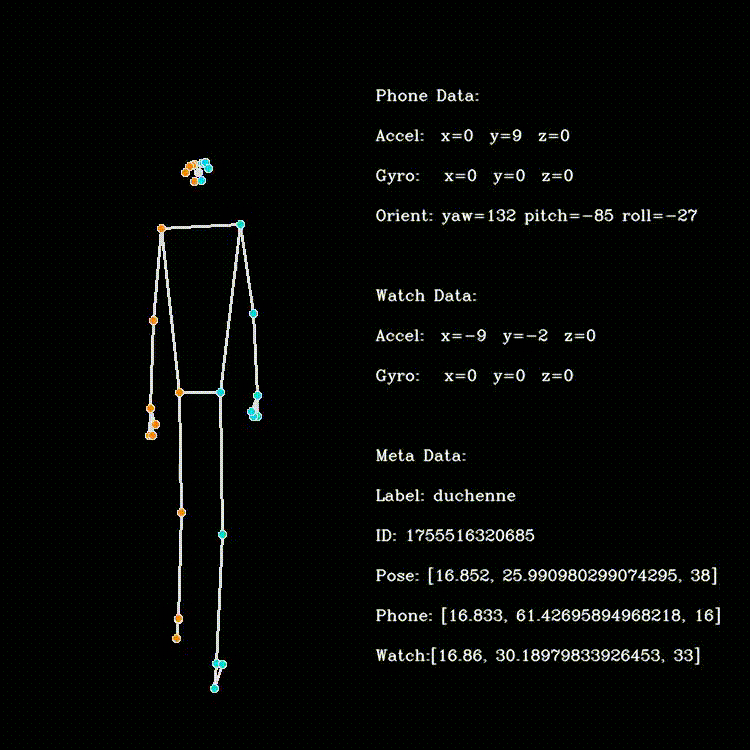

# Multimodal-Pathological-Gait-Dataset
A Multimodal Dataset for Pathological Gait Classification Using Consumer-Grade Devices

paper link 
dataset link

---

## Abstract

Instrumented gait analysis (IGA) utilizes motion data to diagnose gait abnormalities, evaluate treatment efficacy, and inform rehabilitation strategies; however, its resource-, time-, and labor-intensive nature motivates the development of scalable, low-cost consumer-device solutions for remote and routine gait assessment.

Thus, we aim to automatically classify **six gait classes** — five pathological patterns (*paraparesis, hemiparesis, Duchenne, Trendelenburg, and foot drop*) and *normal gait* — using a multimodal setup of commercial sensors.

In cooperation with **three physiotherapy training centers**, we collected recordings of these six classes from recruited physiotherapy trainees, capturing:
* Smartphone inertial sensor data
* Smartwatch inertial sensor data
* Acoustic step signals
* Markerless pose estimates extracted from video

We evaluated both unimodal and multimodal approaches and performed late fusion via majority voting. Unimodal classification achieved accuracies up to **77%** (with pose landmark data yielding the best performance), while combining multiple modalities increased overall accuracy to **89.4%**. 

We provide meaningful baseline results on the dataset, which we make public as a robust reference for future comparisons and methodological developments.

---

## Dataset Overview

### Gait Classes (6 Total)
1. **Normal Gait** (Control)
2. **Paraparesis**
3. **Hemiparesis**
4. **Duchenne Gait**
5. **Trendelenburg Gait**
6. **Foot Drop**

### Recorded Data

An initial total of 430 recordings were collected. Following data cleaning and anonymization, a final total of 407 recordings were retained for further processing. Each recording comprises up to five core files, detailed below:

1. `metadata.json` – Stores the recording ID and the respective gait pattern class.
2. `pose.json` – Contains pose landmark data derived from MediaPipe, recorded at approx. 25 Hz.
3. `phone.json` – Contains the body-worn smartphone's acceleration, gyroscope, and orientation data, recorded at approx. 60 Hz.
4. `watch.json` – Contains the body-worn smartwatch's acceleration and gyroscope data, recorded at approx. 25 Hz.
5. `audio.m4a` – Contains acoustic data on step sounds and arm movements from the smartwatch (included where privacy constraints permit).

Optionally, a visualization video for each recording can be generated via a provided Python script. 

In addition, a file was created that uniquely assigns each recording to a person, enabling person-dependent data splitting for model training in the next step.



---

## Benchmark Baseline Results

| Approach | Setup / Method | Accuracy |
| :--- | :--- | :---: |
| **Unimodal (Best)** | Markerless Pose Landmarks | **77.0%** |
| **Multimodal Fusion** | Late Fusion (Majority Voting) | **89.4%** |

---

## Data Structure
```text
dataset/
├── Location_1/
│   ├── Person_to_Data.json  # Maps multiple recording IDs within Location_1 to participants
│   ├── 0/                          
│   │   ├── meta_data.json           # Recording metadata and gait class
│   │   ├── pose_landmarks.json      # MediaPipe pose landmarks (~25 Hz)
│   │   ├── phone.json               # Smartphone IMU and orientation data (~60 Hz)
│   │   ├── watch.json               # Smartwatch IMU data (~25 Hz)
│   │   ├── audio.m4a                # Smartwatch audio recording (where available)
│   │   └── video.mp4                # Video recording (optional / generated via script)
│   ├── 1/
│   ├── 2/
│   └── ...
├── Location_2/
│   ├── Person_to_Data.json  # Maps multiple recording IDs within Location_2 to participants
│   └── ...
└── Location_3/
    ├── Person_to_Data.json  # Maps multiple recording IDs within Location_3 to participants
    └── ...
